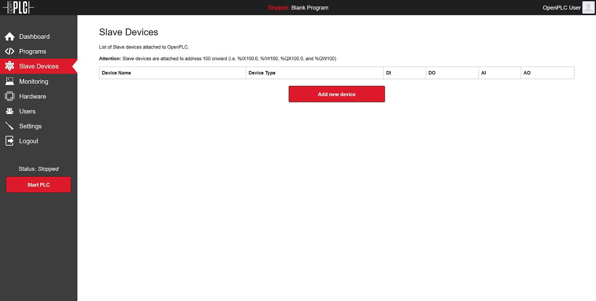
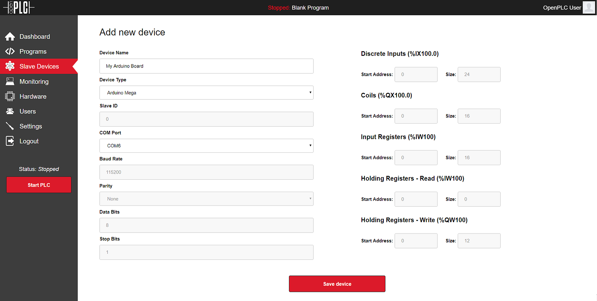

You can attach Arduino boards as slave devices to expand the number of your
I/O points. This is particularly useful for systems that don't have any I/O
points at all (in case of OpenPLC running on Windows for example).

## Set Up Your Host

Given that Arduino boards can only work as slave devices, the first thing you
need to do is set up your host. In other words, you need to have OpenPLC
Runtime installed on your system to proceed. You can use any of the listed
devices on the Getting Started page as a host. The most common options are
[Windows](/runtime/windows), [Linux](/runtime/linux) and
[Raspberry Pi](/runtime/raspberry-pi). Just follow the instructions on the
page to have it installed and then move to the next step.

## Upload Arduino Firmware

This is the easiest part. Just download the proper version of the firmware for
your board, unzip it, and upload it to your Arduino using the Arduino IDE.

    

        

            <a href="https://github.com/thiagoralves/OpenPLC_Files/blob/master/Firmware/OpenPLC_Uno_v3.zip?raw=true">
            
            Uno | Pro | Pro Mini | Nano | Micro | Lilypad | Zero
            </a>
        

    

    

        

            <a href="https://github.com/thiagoralves/OpenPLC_Files/blob/master/Firmware/OpenPLC_Mega_v3.zip?raw=true">
            
            Mega | ADK | Due
            </a>
        

    

## Add a Slave Device to OpenPLC

After programming your Arduino with OpenPLC's firmware, you now need to add
it to the main Runtime. Launch OpenPLC Runtime on your host, log in on the
web interface, go to Slave Devices on the menu and click on "Add new device".

On the new screen that appears, fill out the name for your slave device (it
can be anything, but just please avoid non-english characters like ç, é, ó, ñ),
select the proper Arduino board you have connected under Device Type and the
right COM Port. Everything else should be filled up for you automatically
depending on the selection of your Device Type.

Click on "Save device" and you're good to go! Just start the PLC and you will
see the Rx/Tx LEDs of your Arduino board blinking constantly. This means that
OpenPLC is communicating with the board and reading/writing to its I/O points.

If you see two or three communication timeout messages on the dashboard, don't worry, this is normal. The Arduino boards have an auto-reset feature that resets the board every time a new USB connection is made. Therefore, once OpenPLC initiates a communication, the first attempt to send a message to the board fails because the Arduino board is still booting after a reset. After a few milliseconds the board is fully operational and you shouldn't see error messages anymore.

## Arduino on OpenPLC V2

If you are still running OpenPLC Runtime v2, the firmware for your Arduino
boards is a little different. For compatibility reasons, you can find below
the old firmware that works with OpenPLC v2. Don't try to use this firmware
with the current (OpenPLC v3) version of the Runtime as this will not work.

    

        

            <a href="https://github.com/thiagoralves/OpenPLC_Files/blob/master/Firmware/OpenPLC_UNO_fw.zip?raw=true">
            
            Uno | Pro | Pro Mini | Nano | Micro | Lilypad | Zero
            </a>
        

    

    

        

            <a href="https://github.com/thiagoralves/OpenPLC_Files/blob/master/Firmware/OpenPLC_MEGA_fw.zip?raw=true">
            
            Mega | ADK | Due
            </a>
        

    

## Pin Mapping

Below you can find the pin mapping for Arduino Uno and Arduino Mega boards.
The table was built for OpenPLC v2, but it is still valid for OpenPLC v3,
except that the slave address on v3 starts at position 100 (e.g. %IX100.0,
%IX100.1, etc).

​

