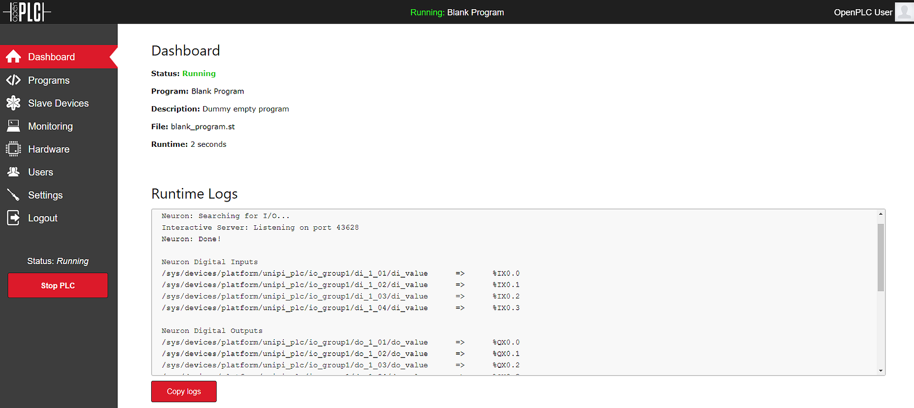

To avoid compatibility problems, it is better to download the most recent
UniPian Neuron OS from the UniPi website and make a fresh install. Also, keep
in mind that when OpenPLC is installed on UniPian, it completely disables EVOK
and all related services.​

The best way to get OpenPLC files into your UniPi Neuron is by using git.
Usually, git comes pre-installed on UniPian. If for some reason you don't have
git installed on your system, you can install it by typing:

```
sudo apt-get update
sudo apt-get install git
```





## Pin Mapping

By default OpenPLC runtime is installed with a blank driver. This means that
it won't be able to control your UniPi Neuron inputs and outputs straight away.
To enable the UniPi Neuron driver, go to the "Hardware" section and, from the
popup menu, select "Neuron". Click on "Save changes" and wait for a little bit
while the driver is applied. Please make sure you have selected the "Neuron"
driver, and not "UniPi v1.1". The UniPi v1.1 driver is for the old UniPi
Industrial Board and won't work with the Neuron.


Given that there are many different types of Neuron PLCs, the OpenPLC Neuron
driver scans the hardware looking for I/Os when it is started. Once the scan
is completed, the driver displays a log on the Dashboard showing all I/Os
found and the respective mapping to OpenPLC located variables:




